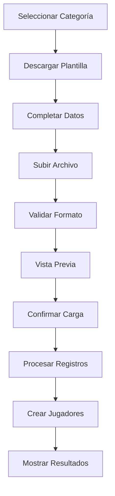

# Carga Masiva de Jugadores

## 📋 Descripción

La funcionalidad de carga masiva permite importar múltiples jugadores desde un archivo Excel/CSV a una categoría específica. Esta herramienta es especialmente útil para el inicio del año deportivo cuando se necesita registrar todos los jugadores de una categoría.

## 🎯 Características

### ✅ Funcionalidades Implementadas

- **Carga desde Excel/CSV**: Soporte para archivos `.csv`, `.xlsx`, `.xls`
- **Validación de datos**: Verificación automática de campos requeridos
- **Resumen de carga**: Muestra la cantidad total de jugadores a cargar
- **Plantilla descargable**: Template con formato correcto
- **Validación de emails**: Verifica que no haya duplicados
- **Validación de fechas**: Formato de fecha correcto
- **Reporte de errores**: Lista detallada de problemas encontrados
- **Carga por categoría**: Asigna automáticamente la categoría seleccionada

### 🔧 Campos Requeridos

El archivo debe contener las siguientes columnas:

| Campo | Descripción | Requerido | Formato |
|-------|-------------|-----------|---------|
| `nombre` | Nombre del jugador | ✅ | Texto |
| `apellido` | Apellido del jugador | ✅ | Texto |
| `email` | Email único | ✅ | Email válido |
| `fecha_nacimiento` | Fecha de nacimiento | ❌ | YYYY-MM-DD |
| `telefono` | Número de teléfono | ❌ | Texto |

## 📱 Cómo Usar

### 1. Acceder a la Funcionalidad

1. **Ir a la página de Categorías**
2. **Seleccionar una categoría**
3. **Hacer clic en "Cargar Jugadores"** (botón verde con ícono de upload)

### 2. Descargar Plantilla

1. **Hacer clic en "Descargar Plantilla"**
2. **Se descargará un archivo CSV** con el formato correcto
3. **Completar con los datos de los jugadores**

### 3. Formato de la Plantilla

```csv
nombre,apellido,email,fecha_nacimiento,telefono
Juan,Pérez,juan.perez@email.com,2005-03-15,123456789
María,González,maria.gonzalez@email.com,2006-07-22,987654321
Carlos,Rodríguez,carlos.rodriguez@email.com,2005-11-08,555666777
```

### 4. Cargar Archivo

1. **Hacer clic en "Seleccionar Archivo"**
2. **Seleccionar el archivo Excel/CSV**
3. **Revisar el resumen** (cantidad total de jugadores)
4. **Hacer clic en "Cargar Jugadores"**

### 5. Revisar Resultados

- **Jugadores creados exitosamente**
- **Lista de errores** (si los hay)
- **Resumen final** con estadísticas

## ⚠️ Validaciones

### Campos Obligatorios
- ✅ Nombre (no puede estar vacío)
- ✅ Apellido (no puede estar vacío)
- ✅ Email (formato válido y único)

### Validaciones Específicas

#### Email
- Debe tener formato válido: `usuario@dominio.com`
- Debe ser único en el sistema
- Se convierte automáticamente a minúsculas

#### Fecha de Nacimiento
- Formato: `YYYY-MM-DD`
- Ejemplo: `2005-03-15`
- Es opcional pero debe ser válida si se proporciona

#### Teléfono
- Campo opcional
- Se guarda como texto

## 🔄 Flujo de Proceso



## 📊 Reporte de Resultados

### Éxito
```
✅ 25 jugadores cargados exitosamente
```

### Con Errores
```
✅ 20 jugadores cargados exitosamente, 5 errores

Errores encontrados:
- Fila 3: Ya existe un jugador con el email juan.perez@email.com
- Fila 7: Email inválido
- Fila 12: Fecha inválida
- Fila 15: Campos requeridos incompletos
- Fila 18: Categoría no encontrada
```

## 🛠️ Implementación Técnica

### Frontend
- **Componente**: `BulkUploadModal.tsx`
- **Servicio**: `playersService.ts` - método `bulkCreatePlayers`
- **Hook**: `usePlayers.ts` - integración con el estado
- **Página**: `Categories.tsx` - botón de carga masiva

### Backend
- **Endpoint**: `POST /api/players/bulk`
- **Validaciones**: Campos requeridos, email único, formato de fecha
- **Transacciones**: Procesamiento individual con rollback por registro
- **Respuesta**: Detalle de éxitos y errores

### Estructura de Datos

```typescript
interface BulkUploadResult {
  success: boolean;
  message: string;
  created: number;
  errors: string[];
  results?: Array<{
    index: number;
    player: Player;
  }>;
}
```

## 🎨 Interfaz de Usuario

### Modal de Carga
- **Tamaño**: Large (max-w-2xl)
- **Información de categoría**: Nombre, género, cuota
- **Zona de arrastrar/soltar**: Para archivos
- **Resumen de carga**: Cantidad total de jugadores
- **Botones de acción**: Descargar plantilla, cargar, cancelar

### Estados Visuales
- **Sin archivo**: Ícono de upload, botón para seleccionar
- **Archivo seleccionado**: Ícono de check, nombre del archivo, resumen de cantidad
- **Procesando**: Spinner, botón deshabilitado
- **Resultado**: Mensaje de éxito/error con detalles

## 🔒 Permisos

### Roles Autorizados
- **Administrador**: Acceso completo
- **Tesorero**: Acceso completo
- **Cobrador**: Sin acceso

### Validaciones de Seguridad
- Token JWT requerido
- Verificación de rol en backend
- Validación de categoría existente

## 📈 Casos de Uso

### 1. Inicio de Temporada
- Cargar todos los jugadores de una categoría
- Asignar automáticamente la categoría correcta
- Validar datos antes de la carga

### 2. Migración de Datos
- Importar jugadores desde sistema anterior
- Validar duplicados por email
- Reporte detallado de errores

### 3. Registro Masivo
- Eventos deportivos
- Inscripciones grupales
- Actualización de listas

## 🚀 Mejoras Futuras

### Funcionalidades Planificadas
- [ ] Soporte para archivos Excel (.xlsx) nativo
- [ ] Validación de edad según categoría
- [ ] Importación de fotos de jugadores
- [ ] Plantillas específicas por categoría
- [ ] Exportación de errores a Excel
- [ ] Carga asíncrona para archivos grandes

### Optimizaciones
- [ ] Procesamiento en lotes
- [ ] Validación previa completa
- [ ] Rollback en caso de errores críticos
- [ ] Logs detallados de la carga

## 🐛 Solución de Problemas

### Errores Comunes

#### "Columnas faltantes"
- Verificar que el archivo tenga las columnas requeridas
- Usar la plantilla descargada como base

#### "Email inválido"
- Verificar formato: usuario@dominio.com
- No usar espacios o caracteres especiales

#### "Ya existe un jugador con este email"
- Verificar si el jugador ya está registrado
- Usar email único para cada jugador

#### "Fecha inválida"
- Usar formato YYYY-MM-DD
- Ejemplo: 2005-03-15

### Debugging
- Revisar la consola del navegador para errores
- Verificar el formato del archivo
- Comprobar permisos de usuario
- Validar conexión con el servidor 